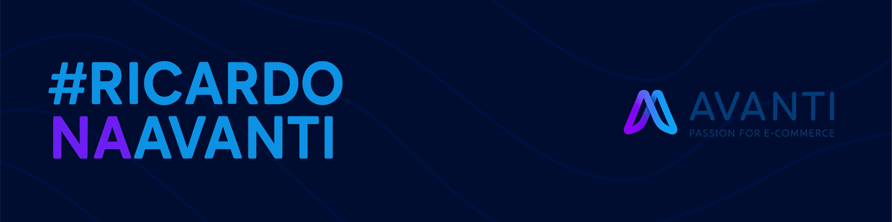
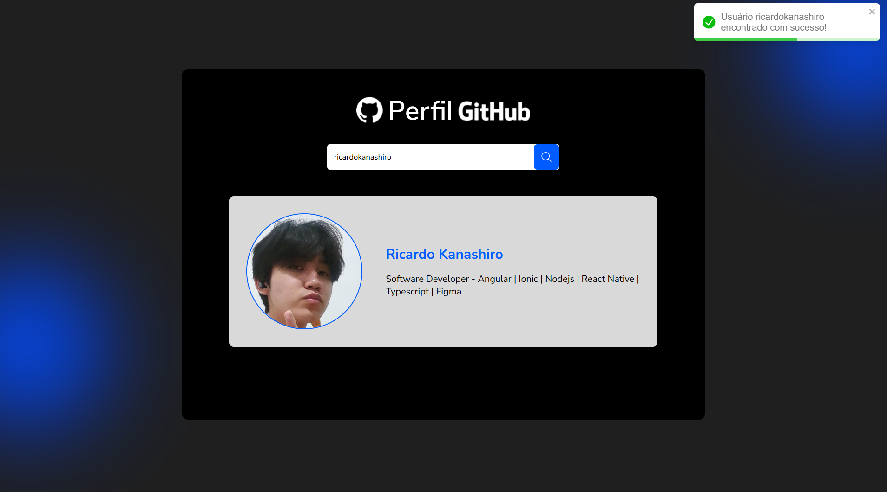

# Projeto Github Finder - Teste Técnico Avanti

<p>Seja bem vindo recrutador, espero que goste :)</p>
Esse projeto se baseia em um site de busca de usuários do Github proposto pela Avanti como segundo projeto do teste técnico de seu processo seletivo.



## Sobre o projeto:



O teste consistia em desenvolver um layout do Figma pré-fornecido e implementar a funcionalidade de busca de usuários, trazendo nome, bio e foto de perfil, através da API do Github.

## Sobre o processo:

No desenvolvimento desse teste, priorizei a implementação de uma estrutura mais objetiva, usando CSS para estilização geral e hooks para gerenciamento de estados das respostas da API para melhor feedback ao usuário.

 &nbsp;
 &nbsp;
 &nbsp;
 &nbsp;

- <b>HTML5</b>: linguagem de marcação de hypertexto utilizada para construir o conteúdo da página.
- <b>CSS3</b>: linguagem de estilização utilizado para estilizar os componentes da página.
- <b>Javascript</b>: linguagem de programação de scripts, utilizado para trazer dinamismo e funções para a página.
- <b>API pública do Github</b>: API para obter informações dos perfis de usuários através de requisições HTTP.

## Meus diferenciais:

- <b>Loading com Skeleton</b>: uso de skeletons no carregamento de dados da API para melhor experiência e feedback ao usuário.
- <b>Alertas Toasts</b>: adição de toasts (mensagens de alerta customizadas) ao buscar usuários ou exibir erros para melhor experiência e feedback ao usuário também.
- <b>Fidelidade ao Figma</b>: design fiel ao Figma, seguindo da melhor forma possível as proporções fornecidas.
- <b>Responsividade completa</b>: implementação de responsividade na página para adaptação em diversos dispositivos e tamanhos de tela.

## Como rodar o projeto?

Para rodar o projeto, siga as instruções abaixo ou <a href="avanti-github-test.vercel.app">clique aqui</a> e acesse o live preview na Vercel.

```shell
   # clone o projeto do Github:
   git clone https://github.com/ricardokanashiro/avanti-github-test.git
```
```shell
   # acesse o diretório do projeto:
   cd avanti-github-test
```
```shell
   # Instale as dependências do projeto com NPM:
   npm install
   # ou
   yarn install
```

```shell
   # Inicie o servidor do projeto e abra na localhost indicada
   npm run dev
   # ou
   yarn dev
```

## Porque me contratar?

- Também sou designer, tendo capacidade de planejar e criar interfaces do zero por meio do Figma.
- Desenvolvedor fiel, que codifica seguindo totalmente os layouts passados do Figma, adaptando com as melhores proporções possíveis.
- Facilidade e sede por aprender novas tecnologias e ferramentas, não me limitando por rótulos.
- Em busca de um ambiente para demonstrar e desenvolver todo meu talento.
- Grande identificação com a cultura da empresa e seus propósitos, também querendo me tornar um criador de conteúdo na área tech.